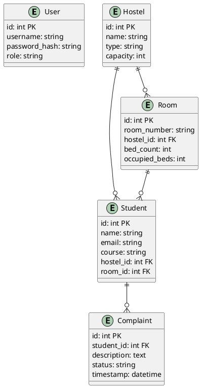
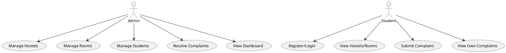

# Software Requirements Specification (SRS)

## Table of Contents
1. [Introduction](#1-introduction)

    1.1 [Purpose](#11-purpose)

    1.2 [Scope](#12-scope)

    1.3 [Definitions](#13-definitions)

2. [System Overview](#2-system-overview)

3. [Functional Requirements](#3-functional-requirements)

    3.1 [User Authentication](#31-user-authentication)

    3.2 [Hostel Management](#32-hostel-management)

    3.3 [Room Management](#33-room-management)

    3.4 [Student Management](#34-student-management)

    3.5 [Complaint Management](#35-complaint-management)

    3.6 [Dashboard](#36-dashboard)

4. [Non-Functional Requirements](#4-non-functional-requirements)

5. [Data Model & ER Diagram](#5-data-model--er-diagram)

    5.1 [Entities](#51-entities)

    5.2 [Relationships](#52-relationships)

    5.3 [ER Diagram (PlantUML)](#53-er-diagram-plantuml)

6. [Use Case Diagram (PlantUML)](#6-use-case-diagram-plantuml)

7. [API Endpoints](#7-api-endpoints)

    7.1 [Authentication](#71-authentication)

    7.2 [Hostels](#72-hostels)

    7.3 [Rooms](#73-rooms)

    7.4 [Students](#74-students)

    7.5 [Complaints](#75-complaints)

8. [UI/UX Overview](#8-uiux-overview)

9. [Security](#9-security)

10. [Deployment](#10-deployment)

# Software Requirements Specification (SRS)

## 1. Introduction

### 1.1 Purpose
This document specifies the requirements for the Hostel Management System, a web-based application designed to manage hostels, rooms, students, users, and complaints efficiently. The system supports both administrative and student roles, providing secure access and streamlined workflows for hostel operations.

### 1.2 Scope
The system allows:
- Admins to manage hostels, rooms, students, and complaints
- Students to register, log in, view hostels/rooms, and submit complaints
- Secure authentication and role-based access

### 1.3 Definitions
- **Admin**: User with elevated privileges to manage all resources
- **Student**: User who can view and interact with their own data and submit complaints

## 2. System Overview

The system is built using Flask (Python) with SQLAlchemy ORM for database management. JWT is used for authentication. The backend exposes RESTful APIs, and the frontend uses HTML templates.

## 3. Functional Requirements

### 3.1 User Authentication
- Register as student or admin
- Login and receive JWT token
- Role-based access control

### 3.2 Hostel Management
- Create, view hostels (admin)
- View hostels (all users)

### 3.3 Room Management
- Assign students to rooms (admin)
- Track available/occupied beds
- View available rooms

### 3.4 Student Management
- Create student records (admin)
- Assign students to hostels/rooms
- View student list

### 3.5 Complaint Management
- Students submit complaints
- Admins resolve/update complaints
- View complaints

### 3.6 Dashboard
- View statistics: total students, hostels, rooms, complaints
- View recent complaints and available rooms

## 4. Non-Functional Requirements
- Secure authentication (JWT)
- Responsive UI
- Data integrity and validation
- Error handling and logging
- Scalability for multiple hostels/rooms

## 5. Data Model & ER Diagram

### 5.1 Entities
- **User**: id, username, password_hash, role
- **Student**: id, name, email, course, hostel_id, room_id
- **Hostel**: id, name, type, capacity
- **Room**: id, room_number, hostel_id, bed_count, occupied_beds
- **Complaint**: id, student_id, description, status, timestamp

### 5.2 Relationships
- Hostel 1---* Room
- Hostel 1---* Student
- Room 1---* Student
- Student 1---* Complaint

### 5.3 ER Diagram (PlantUML)

## 6. Use Case Diagram (PlantUML)

## 7. API Endpoints

### 7.1 Authentication
- POST `/register` — Register user
- POST `/login` — Login and receive JWT

### 7.2 Hostels
- GET `/hostel/` — List hostels
- POST `/hostel/` — Create hostel (admin)

### 7.3 Rooms
- POST `/student/assign-room` — Assign student to room (admin)
- GET `/student/available-rooms` — List available rooms

### 7.4 Students
- GET `/student/` — List students
- POST `/student/` — Create student

### 7.5 Complaints
- GET `/complaint/` — List complaints
- POST `/complaint/` — Submit complaint
- POST `/complaint/<id>/resolve` — Resolve complaint (admin)
- PATCH `/complaint/<id>` — Update complaint status (admin)

### 7.6 Dashboard
- GET `/dashboard/` — View statistics
- GET `/dashboard/details` — View recent complaints, available rooms

## 8. UI/UX Overview
- Login/Register pages
- Admin dashboard with statistics
- Hostel/Room/Student management pages
- Complaint submission and tracking
- Responsive design for desktop and mobile

## 9. Security
- JWT-based authentication
- Passwords hashed with Werkzeug
- Role-based access for admin/student
- Input validation and error handling

## 10. Deployment
- Python 3.13, Flask, SQLAlchemy
- SQLite (default), can be replaced with other RDBMS
- Configurable via `config.py`

---
*End of SRS Document*

